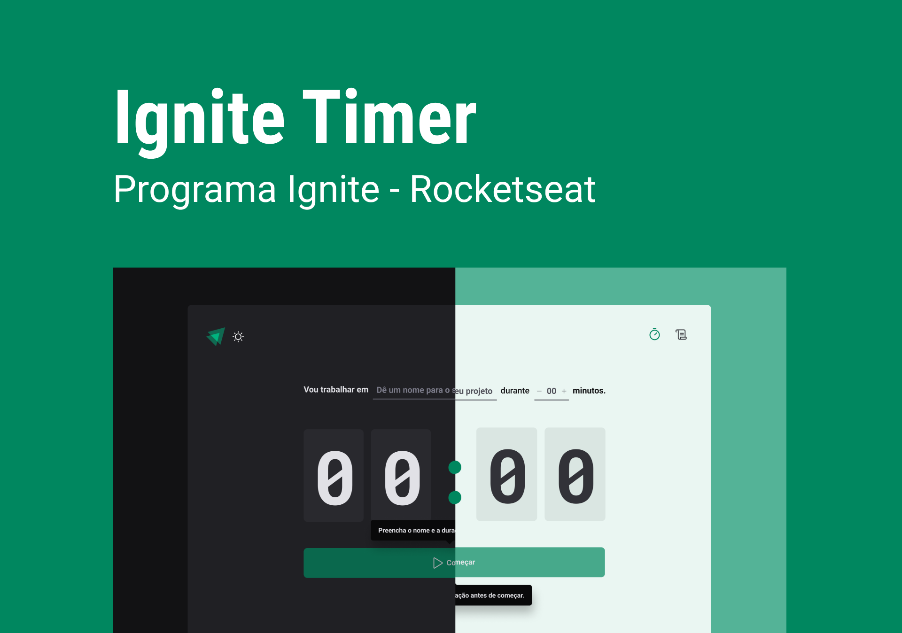
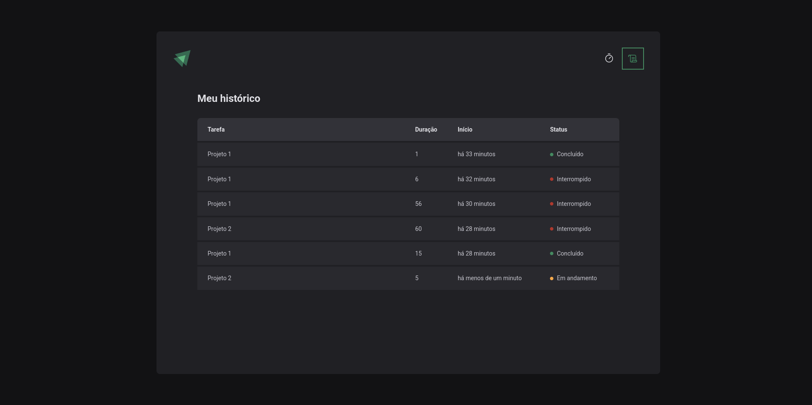

  <h1 align="center">Ignite Timer</h1>

## 💻 Sobre

Um timer interativo com histórico de contagens, ideal para organizar suas tarefas cronometradamente. O tempo registrado é salvo no Local Storage, permitindo acompanhar suas sessões anteriores e melhorar sua produtividade. Simples, eficiente e sem perda de dados!

___

## 🚀 Tecnologias

Este projeto foi desenvolvido com as seguintes tecnologias:

- [React](https://react.dev/)
- [TypeScript](https://www.typescriptlang.org/)
- [Vite](https://vitejs.dev/)
- [Phosphor Icons](https://phosphoricons.com/)
- [React-Hook-Form](https://react-hook-form.com/)
- [Zod](https://zod.dev/)
- [Date-fns](https://date-fns.org/)
- [Immer](https://immerjs.github.io/immer/)
- [Styled-components](https://styled-components.com/)
- [React Router](https://reactrouter.com/)

___

## 🎨 Layout

___

Made with ❤️ by Bruno Henrique de Godoy 👋🏽 [Get in Touch!](https://www.linkedin.com/in/bruno-godoy-07806726b/)
